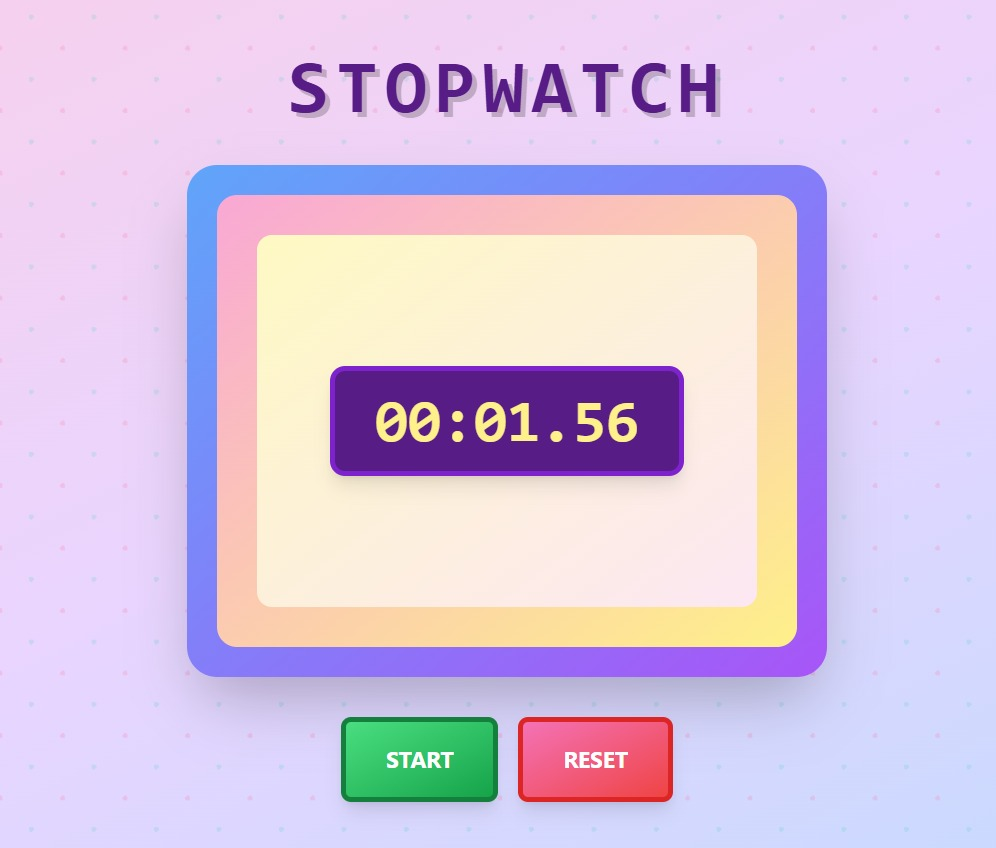

# ⏱️ React Stopwatch

A beautiful, functional stopwatch built using React and Tailwind CSS.
Responsive, accessible, and styled with custom gradients and shadows — perfect for demos or learning timers in React.

---

## 🚀 Features

* Start, Stop, and Reset controls
* Millisecond-level accuracy
* Responsive UI with custom Tailwind styling
* Clean code with component-based architecture

---

## 🛠️ Tech Stack


---

## 📸 Preview



---

## 📦 Installation

```bash
git clone https://github.com/SanyaShresta25/stopwatch-using-useRef.git
cd my-app
npm install
npm run dev
```

---

## 👩‍💻 Author

| Profile                                                                                                                        | Link                                                           |
| ------------------------------------------------------------------------------------------------------------------------------ | -------------------------------------------------------------- |
|     | [GitHub](https://github.com/SanyaShresta25)                    |
|  | [LinkedIn](https://www.linkedin.com/in/sanya-shresta-jathanna) |
|  | [Portfolio](https://sanyashresta.netlify.app/)                 |

---

## 📄 License

This project is licensed under the [MIT License](LICENSE).
